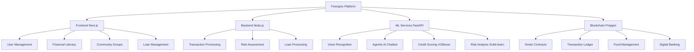

# 💫 FINERGIZE
> **Igniting Financial Inclusion**  
> Empowering communities through blockchain-based financial services

<div align="center">
  
  
  
  
</div>

---

## 🚀 Overview

Finergize is a revolutionary fintech platform that bridges the gap between underserved communities and essential financial services. Our platform leverages cutting-edge technologies including AI, blockchain, and machine learning to create a secure, accessible, and efficient financial ecosystem.

### ✨ Key Features

- 🌐 **Community Savings & Lending Groups**: AI-assisted management for cooperative financial growth
- 📚 **Multilingual Financial Literacy**: Region-specific education in multiple languages
- 💳 **AI-based Micro-loans**: Automated credit assessment for fair lending
- 🚨 **Emergency Financial Assistance**: Proactive alerts and quick loan disbursement
- 🔒 **Blockchain Digital Banking**: Secure, transparent, and decentralized operations
- 📈 **Smart Investment Options**: AI-curated mutual fund recommendations
- 🗣️ **Voice-enabled Interface**: Accessible to users with limited literacy

## 🎥 Platform Demo

<div align="center">
  <a href="https://www.youtube.com/watch?v=wH_cQetC8c4">
    
  </a>
</div>

## 🌟 Problem Statement

### Theme: Financial Technology

**Limited Access to Financial Services**
- Significant population lacks formal banking systems
- Reliance on informal lenders leads to exploitation through high-interest rates

**Lack of Financial Literacy**
- Language, education, and technology barriers prevent financial awareness
- Limited knowledge of savings, insurance, and investment options

**No Emergency Financial Cushion**
- Absence of safety net leaves families vulnerable during crises
- Economic shocks from crop failures, medical emergencies, or natural disasters

**Barriers to Credit Access**
- Lack of credit history excludes people from formal lending opportunities
- Limited financial opportunities for economic growth

## 💡 Our Solution

### Platform Architecture



### Technical Stack

| Component | Technology | Purpose |
|-----------|------------|---------|
| Frontend | Next.js 14 + TypeScript | User interface and experience |
| Backend | Node.js | Primary server application |
| ML Services | FastAPI, TensorFlow, PyTorch | Machine learning models |
| Blockchain | Polygon (MATIC), Solidity | Smart contracts and transactions |
| Database | MongoDB Atlas | Data storage and management |
| AI Integration | Agentic AI, Langchain | Conversational AI and automation |

## 🛠️ Key Components

### 1. Machine Learning Pipeline

```python
# Credit Scoring Model
class CreditScoringEngine:
    def __init__(self):
        self.xgboost_model = XGBoostClassifier()
        self.resnet_model = ResNet50()
        self.yolo_model = YOLOv8()
    
    def assess_creditworthiness(self, user_data):
        # ML-based risk assessment
        risk_score = self.calculate_risk(user_data)
        return self.make_decision(risk_score)
```

### 2. Blockchain Smart Contracts

```solidity
// Smart Contract for Community Banking
contract CommunityBank {
    mapping(address => uint256) public balances;
    mapping(address => uint256) public creditScores;
    
    function depositFunds() public payable {
        balances[msg.sender] += msg.value;
        emit FundsDeposited(msg.sender, msg.value);
    }
    
    function requestLoan(uint256 amount) public returns (bool) {
        require(creditScores[msg.sender] >= 600, "Credit score too low");
        return processLoan(msg.sender, amount);
    }
}
```

### 3. Voice Interface Implementation

```javascript
// Voice Recognition System
const voiceInterface = {
    initSpeechRecognition: () => {
        const recognition = new webkitSpeechRecognition();
        recognition.lang = 'hi-IN'; // Supports multiple languages
        recognition.onresult = handleVoiceCommand;
        return recognition;
    },
    
    processFinancialQuery: async (query) => {
        const response = await AIService.generateResponse(query);
        return speechSynthesizer.speak(response);
    }
};
```

## 🎯 Impact & Benefits

### Social Impact

- **Financial Education**: Short courses on financial literacy
- **Language Accessibility**: Voice-driven multilingual interface
- **Economic Stability**: Improved individual and community financial health
- **Crisis Resilience**: Emergency financial assistance system

### Market Impact

- **Subscription Models**: Premium financial tools and advice
- **Local Presence**: Building community financial hubs
- **High-speed Service**: Rapid response to customer needs
- **Market Diversification**: Adapting to regional demands

## 🚀 Getting Started

### Prerequisites

```bash
# Required tools
- Node.js v18+
- Python 3.9+
- MongoDB
- Polygon wallet
- Git
```

### Installation

```bash
# Clone the repository
git clone https://github.com/codetrek/finergize.git

# Install dependencies
cd finergize
npm install

# Set up environment variables
cp .env.example .env

# Start development server
npm run dev
```

### Running ML Models

```bash
# Install Python dependencies
pip install -r requirements.txt

# Start ML service
cd ml-service
python main.py
```

## 📊 Project Structure

```
finergize/
├── frontend/               # Next.js frontend
│   ├── components/
│   ├── pages/
│   └── styles/
├── backend/               # Node.js backend
│   ├── controllers/
│   ├── models/
│   └── routes/
├── ml-service/           # ML models and APIs
│   ├── models/
│   ├── data/
│   └── api/
├── blockchain/           # Smart contracts
│   ├── contracts/
│   └── migrations/
└── docs/                 # Documentation
```

## 🤝 Team CodeTrek

| Name | Branch | Year | Email | Role |
|------|--------|------|-------|------|
| Arshavi Roy | CSE | 3rd | arshaviroy@gmail.com | Backend Lead & ML Engineer |
| Manaswita Chakraborty | CSE | 3rd | manaswita.ch10@gmail.com | Frontend Lead &  Blockchain Dev|
| Sneha Mahata | CSE(AI & ML) | 3rd | mahatasneha4@gmail.com | ML Engineer |


## 🏆 Achievements

- 🥇 Finalist in SBH 2025 (Smart Bengal Hackathon)
- 🌟 Finalist in AIgnite 2025

## 🔐 Security

Our platform implements:
- End-to-end encryption
- Multi-factor authentication
- Smart contract auditing
- Regular security assessments

## 📝 License

This project is licensed under the MIT License - see the [LICENSE](LICENSE) file for details.

## 💌 Acknowledgments

- Special thanks to our mentors and supporters
- Grateful to the open-source community
- Powered by Polygon and AI technologies

---

<div align="center">
  <b>Finergize © 2025 - Igniting Financial Inclusion</b>
  <br>
  Made with ❤️ by Team CodeTrek
</div>
