# 💫 FINERGIZE
> **Igniting Financial Inclusion**  
> Empowering communities through blockchain-based financial services

<div align="center">
  
</div>

<div align="center">
  
  
  
  
  
</div>

<p align="center">
  
</p>

## 🚀 Overview

<div align="center">
  
  
  
</div>

Finergize is a revolutionary fintech platform that bridges the gap between underserved communities and essential financial services. Our platform leverages cutting-edge technologies including AI, blockchain, and machine learning to create a secure, accessible, and efficient financial ecosystem.

### ✨ Key Features

<table>
<tr>
<td width="33%" valign="top">

**🌐 Community Banking**
- AI-assisted savings groups
- Peer-to-peer lending
- Collective investment pools

</td>
<td width="33%" valign="top">

**📚 Financial Education**
- Multilingual content
- Interactive learning modules
- Voice-enabled tutorials

</td>
<td width="33%" valign="top">

**💳 Smart Lending**
- AI credit scoring
- Instant loan approval
- Flexible repayment options

</td>
</tr>
<tr>
<td width="33%" valign="top">

**🔒 Blockchain Security**
- Transparent transactions
- Smart contract automation
- Decentralized operations

</td>
<td width="33%" valign="top">

**🚨 Emergency Support**
- Crisis detection alerts
- Quick fund disbursement
- Community support network

</td>
<td width="33%" valign="top">

**📈 Investment Tools**
- AI mutual fund advisor
- Market insights
- Portfolio tracking

</td>
</tr>
</table>

<p align="center">
  
</p>

## 🎥 Platform Demo

<div align="center">
  <a href="https://www.youtube.com/watch?v=wH_cQetC8c4">
    
  </a>
  
  <p>
    
  </p>
</div>

## 💡 Platform Architecture

```mermaid
graph LR
    %% Define styles
    classDef frontend fill:#000000,stroke:#fff,stroke-width:2px,color:#fff
    classDef backend fill:#4EA94B,stroke:#fff,stroke-width:2px,color:#fff
    classDef blockchain fill:#7B3FE4,stroke:#fff,stroke-width:2px,color:#fff
    classDef ml fill:#FF6F00,stroke:#fff,stroke-width:2px,color:#fff
    classDef database fill:#47A248,stroke:#fff,stroke-width:2px,color:#fff
    classDef user fill:#3DADE8,stroke:#fff,stroke-width:2px,color:#fff
    
    %% Define nodes
    USER((👥 Users)):::user
    FRONTEND[Next.js Frontend]:::frontend
    BACKEND[Node.js Backend]:::backend
    ML[ML Engine]:::ml
    BLOCKCHAIN[Polygon Blockchain]:::blockchain
    DB[(MongoDB)]:::database
    
    %% Define connections
    USER <-->|Web/Mobile| FRONTEND
    USER <-->|Voice| ML
    FRONTEND <-->|API| BACKEND
    BACKEND <-->|Data| DB
    BACKEND <-->|Transactions| BLOCKCHAIN
    ML <-->|Models| BACKEND
    ML <-->|Training| DB
    BLOCKCHAIN <-->|Smart Contracts| BACKEND
```

<div align="center">
  <h3>🏗️ System Design</h3>
</div>



<div align="center">
  <h3>🔄 Data Flow</h3>
</div>


<p align="center">
  
</p>

## 🛠️ Technical Stack

<div align="center">
  <table>
    <tr>
      <td align="center" width="100">
        
        <br/><b>Next.js</b>
        <p><sub>Frontend Framework</sub></p>
      </td>
      <td align="center" width="100">
        
        <br/><b>Node.js</b>
        <p><sub>Backend Server</sub></p>
      </td>
      <td align="center" width="100">
        
        <br/><b>Python</b>
        <p><sub>ML Services</sub></p>
      </td>
      <td align="center" width="100">
        
        <br/><b>Polygon</b>
        <p><sub>Blockchain</sub></p>
      </td>
      <td align="center" width="100">
        
        <br/><b>MongoDB</b>
        <p><sub>Database</sub></p>
      </td>
    </tr>
    <tr>
      <td align="center" width="100">
        
        <br/><b>Solidity</b>
        <p><sub>Smart Contracts</sub></p>
      </td>
      <td align="center" width="100">
        
        <br/><b>TensorFlow</b>
        <p><sub>ML Models</sub></p>
      </td>
      <td align="center" width="100">
        
        <br/><b>PyTorch</b>
        <p><sub>Deep Learning</sub></p>
      </td>
      <td align="center" width="100">
        
        <br/><b>FastAPI</b>
        <p><sub>ML API</sub></p>
      </td>
      <td align="center" width="100">
        
        <br/><b>Docker</b>
        <p><sub>Containerization</sub></p>
      </td>
    </tr>
  </table>
</div>

<p align="center">
  
</p>

## 🌟 Problem & Solution

<div align="center">
  <table>
    <tr>
      <td align="center" width="50%">
        <h3>🎯 Problems We Solve</h3>
        
🚫 **Limited Financial Access**
- Unbanked population
- High-interest informal lending
        
🚫 **Financial Illiteracy**  
- Language barriers
- Limited education
        
🚫 **Crisis Vulnerability**
- No emergency funds
- Economic shocks
        
🚫 **Credit Invisibility**
- No credit history
- Limited growth opportunities
      </td>
      <td align="center" width="50%">
        <h3>✅ Our Solutions</h3>
        
✨ **Blockchain Banking**
- Digital wallet system
- Smart contract automation
        
✨ **AI Education**
- Multilingual content
- Voice-enabled learning
        
✨ **Emergency Safety Net**
- Crisis alerts
- Quick fund access
        
✨ **AI Credit Scoring**
- Alternative data assessment
- Fair lending decisions
      </td>
    </tr>
  </table>
</div>

<p align="center">
  
</p>

## 🤝 Team CodeTrek

<div align="center">
  <table>
    <tr>
      <td align="center" width="33%">
        <h3>Arshavi Roy</h3>
        <p><b>Backend Lead & ML Engineer</b></p>
        <p>CSE | 3rd Year</p>
        <a href="mailto:arshaviroy@gmail.com">📧 arshaviroy@gmail.com</a>
      </td>
      <td align="center" width="33%">
        <h3>Manaswita Chakraborty</h3>
        <p><b>Frontend Lead & Blockchain Dev</b></p>
        <p>CSE | 3rd Year</p>
        <a href="mailto:manaswita.ch10@gmail.com">📧 manaswita.ch10@gmail.com</a>
      </td>
      <td align="center" width="33%">
        <h3>Sneha Mahata</h3>
        <p><b>ML Engineer</b></p>
        <p>CSE(AI & ML) | 3rd Year</p>
        <a href="mailto:mahatasneha4@gmail.com">📧 mahatasneha4@gmail.com</a>
      </td>
    </tr>
  </table>
</div>

<p align="center">
  
</p>

## 🏆 Achievements

<div align="center">
  
  
  <h3>🌟 Recognition</h3>
  
  <table>
    <tr>
      <td align="center">
        
        <p><b>Smart Bengal Hackathon 2025</b></p>
      </td>
      <td align="center">
        
        <p><b>AIgnite Hackathon 2025</b></p>
      </td>
    </tr>
  </table>
</div>

<p align="center">
  
</p>

## 🚀 Getting Started

### Prerequisites

```bash
# Clone the magic
git clone https://github.com/codetrek/finergize.git

# Install dependencies
npm install && pip install -r requirements.txt

# Set up environment
cp .env.example .env

# Launch to the moon 🚀
npm run dev
```

<p align="center">
  
</p>

## 🔐 Security

<div align="center">
  <table>
    <tr>
      <td align="center" width="25%">
        
        <p><b>E2E Encryption</b></p>
      </td>
      <td align="center" width="25%">
        
        <p><b>Multi-Factor Auth</b></p>
      </td>
      <td align="center" width="25%">
        
        <p><b>Smart Contract Auditing</b></p>
      </td>
      <td align="center" width="25%">
        
        <p><b>Regular Assessments</b></p>
      </td>
    </tr>
  </table>
</div>

<p align="center">
  
</p>

## 📜 License

<div align="center">
  
  <p>This project is licensed under the MIT License</p>
</div>

<p align="center">
  
</p>

## 💌 Acknowledgments

<div align="center">
  
  
  <p>Special thanks to our mentors and supporters</p>
  <p>Grateful to the open-source community</p>
  <p>Powered by Polygon and AI technologies</p>
</div>

<p align="center">
  
</p>

<div align="center">
  <h2>🌟 Finergize © 2025 - Igniting Financial Inclusion 🌟</h2>
  <p><b>Made with ❤️ by Team CodeTrek</b></p>
  
  
  
</div>
